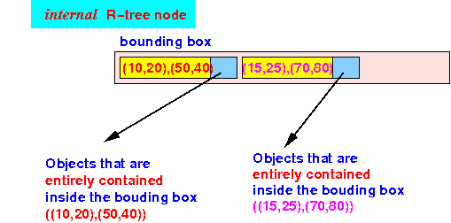
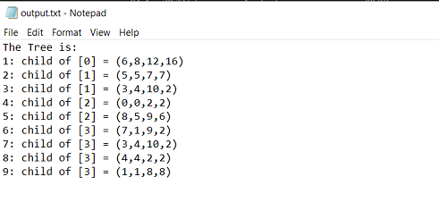
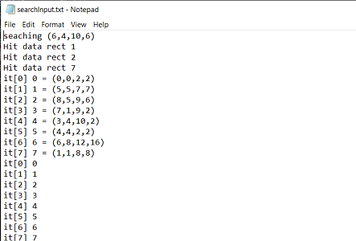
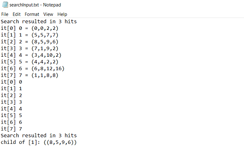

<h1 align="center">Implementation of Rtree in Cpp</h1>
ADS Programming Assignment .

 ####  R-tree is a tree data structure used for storing spatial data indexes in an efficient manner. R-trees are highly useful for spatial data queries and storage. Some of the real life applications are mentioned below:
  - Indexing multi-dimensional information.
  - Handling geospatial coordinates.
  - Implementation of virtual maps.

 ####  Properties of R-tree:
  - Consists of a single root, internals nodes and leaf nodes.
  - Root contains the pointer to the largest region in the spatial domain.
  - Parent nodes contains pointers to their child nodes where region of child nodes completely overlaps the regions of parent nodes.
  - Leaf nodes contains data about the MBR to the current objects.
  - MBR-Minimum bounding region refers to the minimal bounding box parameter surrounding the region/object under consideration.

  - No of comparisions required : (N + log  2  N – 2)
  - Time Complexity : (N + log  2  N)
  - Code implemented in C++.
 
 #### Representaion of objects in tree
  

  
  

  
 #### Typical node structure of nodes in Rtree
  

  
  

  

  ### How to Use
 -  main.cpp file contain code for this.
 -  Run that file on any c++ compiler.
 ## Sample input objects(rectangles):
   - Rect(0, 0, 2, 2), // xmin, ymin, xmax, ymax (for 2 dimensional RTree)
   - Rect(5, 5, 7, 7),
   - Rect(8, 5, 9, 6),
   - Rect(7, 1, 9, 2),
   - Rect(3, 4, 10, 2),
   - Rect(4, 4, 2, 2),
   - Rect(6, 8, 12, 16),
   - Rect(1, 1, 8, 8),
 
 ### After inserting of all objects:
  

  
  

  
 ### For Search of object (6,4,10,6)
  

  
  

  

  
  

  
  ### Runtime complexity
  - Search: average complexity is 
  - Insert: average complexity is 
   ##### where m is branch factor, and N is number of nodes in tree. 
  
  #### To split the node, in case of full node, we can apply 
   - Linear split  
   - Quadrratic split complexity 
   - Exponential Split, checking every possible partition, complexity 
   ##### where m is branch factor, and N is number of nodes in tree. 
  
  ##### Here, we have applied Linear split which is more effcient for runtime. But, Exponential split is more efficient in terms of     splitted node area covered.   
  For complete descussion: 
  - "http://www.bowdoin.edu/~ltoma/teaching/cs340/spring08/Papers/Rtree-chap1.pdf"
  - "http://www.mathcs.emory.edu/~cheung/Courses/554/Syllabus/3-index/R-tree.html"
  
